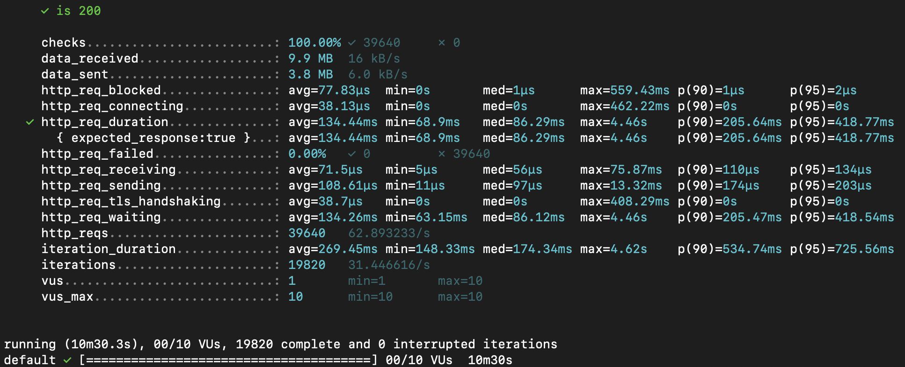
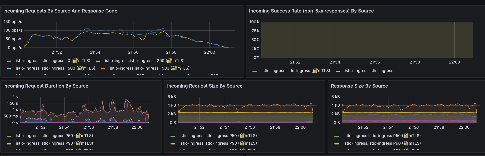

## Introduction

This is my final project of Machine Learning Systems Engineering @ MIDS.

In this project, I deployed a DistilBERT model as an API on Azure Kubernetes Service (AKS). The API processes natural language input from users, and returns the associated sentiment scores. This setup leverages the scalability and reliability of AKS to handle varying loads of user requests efficiently. The tools used in the project are

- Potery for managing libraries and dependencies
- Pytest for testing
- Pydantic library for model input and output type definition and validation
- Docker for packaking the code and Docker conatiner as well as Minikube for deploying the api locally
- Redis for caching
- Kustomize for k8s deployment into AKS
- Istio for service mesh (ingress, gateway, virtual service)
- K6 for generating load test traffic
- Grafana for visualizing performance and monitoring metrics

## Results

100% requests returned success code 200.
P99 indeed was <2s

## FAQ

How did I build and deploy this app in AKS?

- build a Docker image containing the Python app using the Dockerfile. This file uses a multi-stage build and sets all necessary dependencies and appropriate configurations for the app
- use build-push.sh to automates the building and pushing of Docker image tagged with the last Git commit SHA to Azure Container Registry, for later deployment in Azure Kubernetes Service
- apply patches to the kustomization.yaml file within the /overlays/prod directory to reference the Docker image stored in ACR
- set up a virtualservice within the namespace of my pythonapi, but subscribe to my gateway in istio-ingress namespace; this virtual service should route the traffic from istio-ingress to my pythonapi-service at port 8000
- use "kubectl apply -k .k8s/overlays/prod" to deploy the app over AKS

To test that the api is working:

- with clustering running, try curl -X POST "https://nicoleliu.mids255.com/project-predict" -H "Content-Type: application/json" -d '{"text": ["I love you!", "I hate you!", "I am a k8s Cluster!"]}'

What does kustomize do for us?

- it makes CRDs easy and allows us to define a set of base resources so as not to repeat them in all env
- it allows us to easily change configs depending on the env, with overlays and patches
- it can easily generate configmaps and secrets

What are the benefits of Redis caching?

- it reduces the burden of the server, network and databases becuase the recent requests and results are already stored in-memory and so we don't have to send same requests and data repeatedly. It also reduces latency and improves user experience

What does a kubernetes service do?

- it defines a logical set of pods and a policy to access them. It exposes certain pods to external network traffic by defining what ports the containers should be listening to. It directs network traffic to the appropriate pods (e.g. via load balancer). It also enables communications between different parts within a cluster

What does a kubernetes deployment do?

- it defines the right amount of resources (number of pods) in a replicaSet and contains information about which Docker image to deploy etc. It automates the creation and updates and deletion of pods. It also facilitates rolling updates

What does Python Poetry handle for us?

- python poetry is a package mangaement system; it handles all the dependencis for us

What advantages do multi-stage docker builds give us?

- it reduces the image size, e.g. I installed poetry in the build stage but not in the deploy stage, and hence the final image is smaller given the absence of poetry

What does Pydantic handle for us?

- it enforces type validation and value-based validation
- it converts inputs in JSON into python data models
- it automatically generates API documentation
- it automatically creates informative error messages
